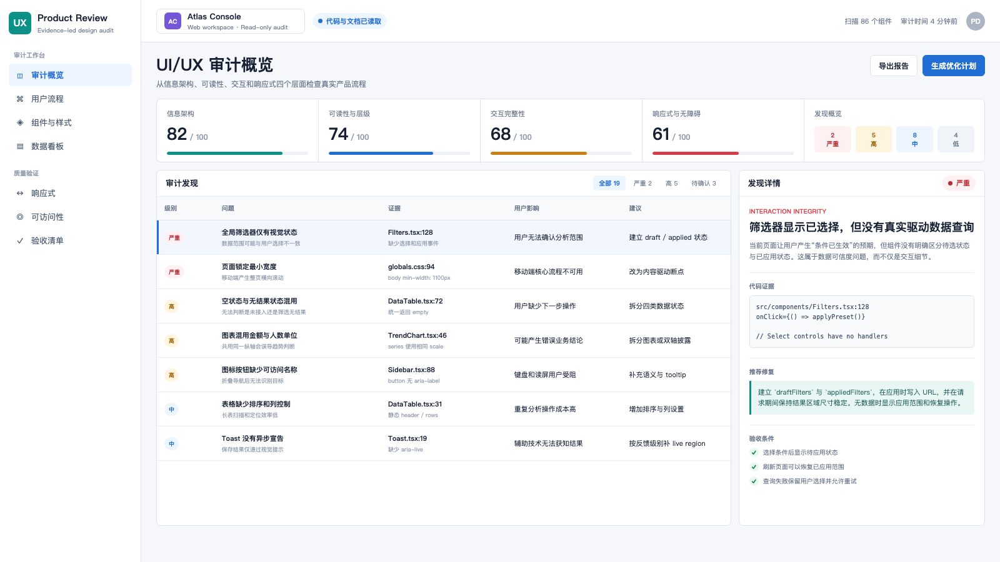
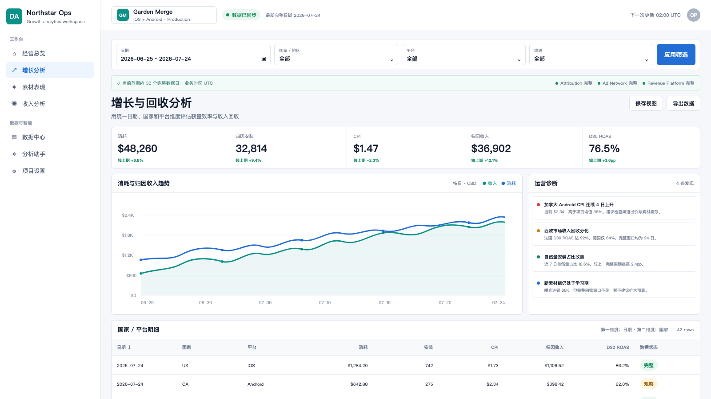
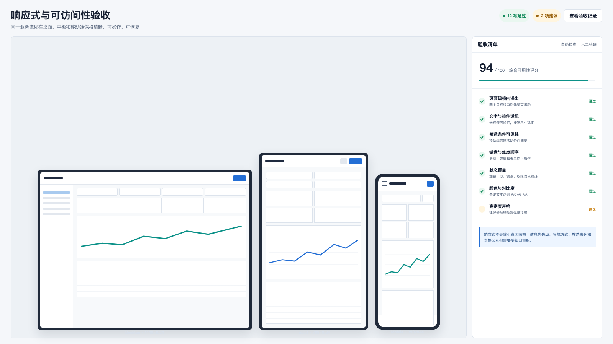

# GameLog UI/UX Product Designer Skill

一个面向中文 Web 产品、数据后台、运营工作台、交互原型和运营报告的 Codex Skill。

它不只生成视觉稿，而是从信息架构、用户流程、数据可信度、交互状态和权限边界出发，覆盖 UI/UX 分析、页面设计、前端落地、响应式、可访问性和浏览器验收。

## 效果示例

以下界面均为通用示意，使用虚构产品、路径与数据，不代表真实客户项目。

### 证据驱动的 UI/UX 审计



从信息架构、可读性、交互完整性和响应式等维度评分，并把每条发现关联到代码证据、用户影响、修复建议和验收条件。

### 面向真实决策的数据后台



统一项目上下文、数据完整日期、筛选器、KPI、趋势、诊断和明细表，避免只做漂亮但无法验证数据范围的看板。

### 桌面、平板与移动端验收



响应式设计通过导航、筛选器、KPI、图表和表格重组实现，同时验证溢出、文字适配、键盘焦点、状态覆盖和颜色对比度。

## 适用场景

- 审查现有 Web 产品的 UI/UX 与前端实现
- 设计数据后台、SaaS 工作台和运营控制台
- 规划页面结构、路由、导航与关键用户流程
- 建立或整理设计系统与组件规范
- 优化筛选器、表格、图表、弹窗、侧边栏和顶部导航
- 补齐加载、空状态、错误、权限、部分数据和操作反馈
- 检查桌面端、平板和移动端适配
- 为实施方案提供可验证的验收清单

## 核心原则

- 先解决真实产品流程，再处理视觉装饰
- 桌面端优先，但不通过页面锁宽伪装成响应式
- 强调中文界面的可读性、信息层级和操作反馈
- 数据看板必须披露来源、日期、时区、完整性和刷新状态
- 不把演示数据伪装成真实数据
- 不复制具体项目、品牌、账号、密钥或私有业务数据

## 安装

### 方式一：复制安装

```bash
git clone https://github.com/hxgame-dog/gamelog-uiux-product-designer-skill.git
mkdir -p ~/.codex/skills
cp -R gamelog-uiux-product-designer-skill/uiux-product-designer ~/.codex/skills/
```

重新打开 Codex 会话后，即可通过 `$uiux-product-designer` 显式调用。

### 方式二：符号链接

适合需要拉取仓库更新或参与开发的用户：

```bash
git clone https://github.com/hxgame-dog/gamelog-uiux-product-designer-skill.git
mkdir -p ~/.codex/skills
ln -s "$(pwd)/gamelog-uiux-product-designer-skill/uiux-product-designer" \
  ~/.codex/skills/uiux-product-designer
```

如果目标目录已存在，请先备份已有版本，不要直接覆盖个人修改。

## 使用示例

### UI/UX 审计

```text
$uiux-product-designer
请对当前项目进行只读 UI/UX 审计，重点检查信息架构、字体可读性、
筛选器、表格、响应式和可访问性。先不要修改代码。
```

### 页面设计

```text
$uiux-product-designer
请为一个中文数据后台设计项目管理和项目设置流程，
输出页面层级、状态矩阵、组件清单和响应式规则。
```

### 前端落地

```text
$uiux-product-designer
请基于当前仓库的技术栈实现这个工作台页面，
补齐 loading、empty、error、permission 和 mobile 状态，
并使用浏览器截图完成验收。
```

### 数据看板优化

```text
$uiux-product-designer
请检查当前看板的 KPI、图表、表格、筛选器和数据来源表达，
判断它们是否支持真实分析决策，并实施已确认的优化。
```

## 应用于非游戏项目

仓库名称中的 `gamelog` 只是发布命名，`uiux-product-designer` Skill 本身不依赖游戏行业。它可以用于 SaaS、CRM/ERP、电商运营、财务与商业分析、内容管理、教育平台、客户支持和企业内部工具。

在非游戏项目中调用时，应明确产品领域、目标用户和真实工作流，并要求 Skill 遵循当前行业语言。不要让它套用游戏行业的导航、指标或数据结构。

### 通用非游戏项目审计

```text
$uiux-product-designer
这是一个非游戏 Web 项目，请先进行只读 UI/UX 审计，不要修改代码。

产品领域：<例如 CRM、财务管理、内容平台、教育后台>
目标用户：<例如销售主管、财务人员、内容运营、教师>
关键流程：<例如线索分配、账单核对、内容发布、课程排期>
重点页面：<填写路由或页面>
必须保留：<现有业务规则、权限与设计约束>

请读取当前仓库的路由、组件、样式、文档和测试，检查信息架构、
任务完成效率、表单与表格、状态反馈、响应式和可访问性。
使用当前行业的术语与数据对象，不要套用游戏行业的模块或指标。
按严重程度提供文件证据、用户影响和分阶段优化方案。
```

### SaaS、CRM 或企业工作台

```text
$uiux-product-designer
请优化当前 SaaS 工作台的客户管理流程。

重点检查客户列表、搜索筛选、批量操作、详情侧栏、权限状态和操作反馈。
保留现有 API、字段与权限逻辑，优先复用当前设计系统和公共组件。
先输出流程问题与实施顺序，确认后再修改，并完成桌面与移动端验收。
```

### 电商、财务或运营数据后台

```text
$uiux-product-designer
请审查当前运营数据后台的可用性与数据可信度。

重点检查日期与业务时区、筛选条件、KPI 口径、图表单位、表格维度、
数据来源、更新时间、部分数据和导出状态。
不要修改指标定义或财务口径；发现口径不明确时先列出风险并等待确认。
```

### 内容、教育或审批型系统

```text
$uiux-product-designer
请优化当前内容发布与审核流程。

检查草稿、提交、审核、驳回、重新编辑和发布后的完整状态，
确保不同角色能理解当前进度、可执行操作和失败恢复方式。
先保留现有业务行为完成 UX 审计，再实施已确认的界面优化。
```

无论行业是什么，都建议至少提供：

- 产品领域与主要用户角色
- 用户需要完成的关键任务
- 核心业务对象和行业术语
- 权限、审计、合规或数据口径限制
- 已知问题、参考页面与目标视口
- 允许修改和禁止修改的代码范围

## 优化已有项目

针对已有项目，建议先在项目根目录启动 Codex，让 Skill 读取真实路由、组件、样式、产品文档和现有测试。不要只提供一张截图后直接要求重写页面。

推荐分三个阶段调用。

### 1. 先进行只读审计

```text
$uiux-product-designer
请对当前已有项目进行只读 UI/UX 审计，先不要修改代码。

请读取项目的路由、页面组件、布局组件、全局样式、设计变量、
产品文档和现有测试，并检查：
1. 信息架构和关键用户流程
2. 字体、间距、颜色和视觉层级
3. 筛选器、表格、图表、表单、弹窗和导航
4. loading、empty、error、permission 和操作反馈
5. 1440×1024、1280×720、768×1024、390×844 的响应式风险
6. 键盘操作、焦点、语义结构和对比度

请按严重程度列出问题，提供文件或页面证据，并给出分阶段优化方案。
保留当前可用业务流程，不做无关重构。
```

### 2. 确认范围后实施

```text
$uiux-product-designer
确认实施上一轮审计中的高优先级问题。

请遵循当前项目的技术栈、组件模式和设计变量，优先修改公共组件，
不要改动业务口径、权限规则、真实数据和无关文件。
补齐必要的加载、空、错误、禁用和成功状态，并为高风险改动添加测试。
```

### 3. 完成浏览器验收

```text
$uiux-product-designer
请对本轮 UI/UX 修改进行完整验收。

运行项目已有的 typecheck、lint、test 和 build，
并使用浏览器检查核心流程以及桌面、平板、移动端视口。
重点确认没有文字重叠、横向页面溢出、失效控件、隐藏的活动筛选条件、
控制台错误和不可恢复的操作状态。最后列出验证结果和剩余风险。
```

如果需求范围已经明确，也可以一次性调用：

```text
$uiux-product-designer
请优化当前已有项目的 UI/UX。先读取仓库并审计现状，再制定实施顺序，
随后在不改变业务逻辑和数据口径的前提下完成高优先级修复。

重点页面：<填写路由或页面>
目标用户：<填写角色>
主要问题：<填写已知问题>
必须保留：<填写现有交互或设计约束>
目标视口：1440×1024、1280×720、768×1024、390×844

完成后运行项目检查，并通过浏览器截图、键盘操作和核心流程验证结果。
```

为了获得更准确的结果，调用时最好补充：

- 需要优化的路由、页面或用户流程
- 目标用户和权限角色
- 已知问题、截图或参考设计
- 必须保留的业务行为和设计约束
- 允许修改的目录和禁止修改的范围
- 需要支持的设备、浏览器和验收尺寸

## 工作方式

Skill 会根据任务选择不同流程：

1. **只读审计**：分析并输出证据，不修改文件。
2. **设计规格**：定义用户目标、页面结构、状态矩阵、设计系统和验收条件。
3. **前端实现**：遵循现有技术栈实现真实流程，并完成类型、测试和浏览器验证。
4. **完整重构**：先审计再拆分阶段，避免破坏现有可用功能。

详细规则按需存放在：

- `references/design-system.md`
- `references/layout-patterns.md`
- `references/interaction-patterns.md`
- `references/dashboard-patterns.md`
- `references/uiux-checklist.md`

## 静态检查工具

Skill 包含一个无第三方依赖的辅助检查脚本：

```bash
python3 uiux-product-designer/scripts/validate-uiux.py /path/to/web-project
```

输出 JSON：

```bash
python3 uiux-product-designer/scripts/validate-uiux.py \
  /path/to/web-project \
  --format json
```

在发现严重问题时返回非零退出码：

```bash
python3 uiux-product-designer/scripts/validate-uiux.py \
  /path/to/web-project \
  --fail-on critical
```

脚本用于发现小字号、页面锁宽、焦点样式、图片替代文本、图标按钮标签等常见风险。它只是辅助工具，不能替代真实浏览器、键盘、响应式和可访问性验收。

## 输出模板

`assets/templates/` 提供：

- `design-brief.md`：产品与设计输入简报
- `screen-spec.md`：页面设计和状态规格
- `ui-audit-report.md`：按严重程度组织的审计报告

## 目录结构

```text
uiux-product-designer/
├── SKILL.md
├── agents/
│   └── openai.yaml
├── references/
│   ├── design-system.md
│   ├── layout-patterns.md
│   ├── interaction-patterns.md
│   ├── dashboard-patterns.md
│   └── uiux-checklist.md
├── assets/
│   └── templates/
└── scripts/
    └── validate-uiux.py
```

## 隐私与安全

该仓库是通用方法库，不应提交：

- 产品密钥、Token、Cookie 或登录信息
- 真实用户数据、业务日志或数据库导出
- 私有项目截图、品牌素材或未公开 PRD
- 特定客户、项目或账号配置

提交改动前建议运行：

```bash
rg -n -i 'api[_-]?key|secret|token|password|cookie|authorization' .
```

## 限制

- 静态检查不能证明页面已经可用。
- 自动化可访问性工具不能替代键盘和辅助技术测试。
- Skill 不强制某个前端框架或组件库。
- 设计规则应服从具体产品受众、任务密度和现有设计系统。

## Contributing

欢迎通过 Issue 或 Pull Request 提交通用规则、检查项、模板和真实但已脱敏的使用案例。请保持 Skill 与具体产品、品牌和私有数据解耦。

## English Quick Start

This Codex Skill audits, designs, implements, and validates practical UI/UX for web products, analytics dashboards, operational consoles, prototypes, and reports.

```bash
git clone https://github.com/hxgame-dog/gamelog-uiux-product-designer-skill.git
mkdir -p ~/.codex/skills
cp -R gamelog-uiux-product-designer-skill/uiux-product-designer ~/.codex/skills/
```

Invoke it explicitly:

```text
$uiux-product-designer Audit this dashboard for information architecture,
workflow completeness, readability, responsiveness, and accessibility.
```

For an existing project, run Codex from the repository root and start with a read-only audit:

```text
$uiux-product-designer Audit this existing project without modifying files.
Inspect its routes, components, styles, product documentation, states,
responsive behavior, and accessibility. Rank findings by severity with
file evidence, then propose an implementation and browser-validation plan.
Preserve working business behavior and avoid unrelated refactors.
```

The Skill is not game-specific. For a non-game product, provide the domain, user roles, critical workflows, business objects, terminology, permissions, and compliance constraints. Explicitly ask it to preserve existing business rules and avoid game-specific navigation or metrics.

```text
$uiux-product-designer Audit this non-game SaaS project without modifying files.
Domain: customer relationship management.
Users: sales managers and account owners.
Critical workflows: lead assignment, pipeline review, and account handoff.
Preserve the current API, permissions, terminology, and business rules.
Report evidence-backed findings and an implementation plan before editing.
```

The bundled validator is advisory and must be followed by browser and accessibility verification.

## License

[MIT](LICENSE)
